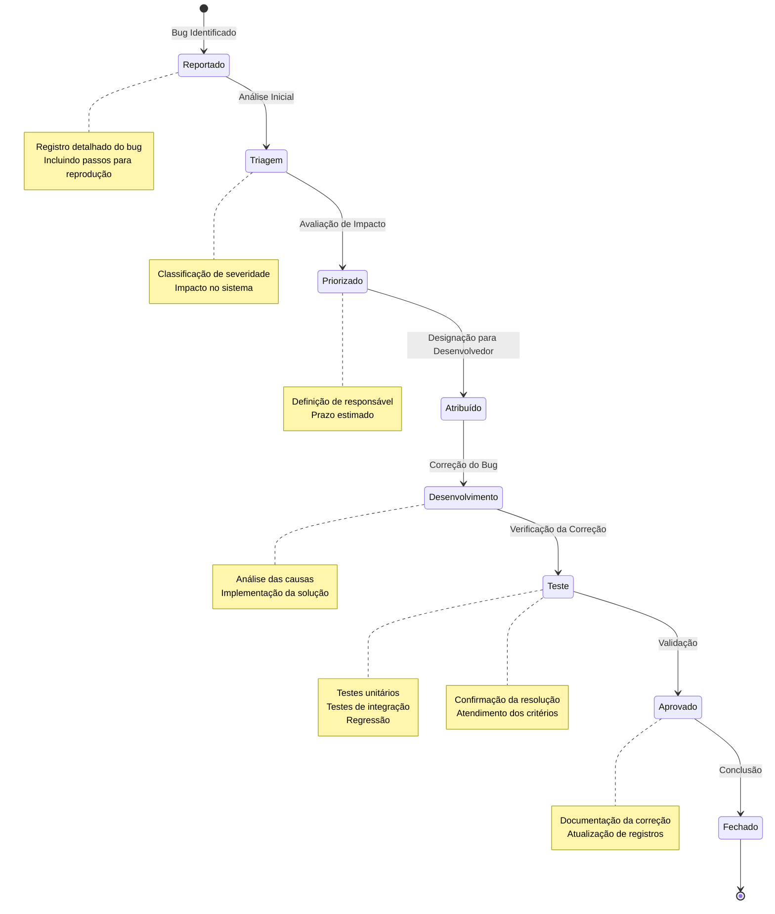

```mermaid
stateDiagram-v2
    [*] --> Reportado: Bug Identificado
    
    Reportado --> Triagem: Análise Inicial
    note right of Reportado
        Registro detalhado do bug
        Incluindo passos para reprodução
    end note
    
    Triagem --> Priorizado: Avaliação de Impacto
    note right of Triagem
        Classificação de severidade
        Impacto no sistema
    end note
    
    Priorizado --> Atribuído: Designação para Desenvolvedor
    note right of Priorizado
        Definição de responsável
        Prazo estimado
    end note
    
    Atribuído --> Desenvolvimento: Correção do Bug
    note right of Desenvolvimento
        Análise das causas
        Implementação da solução
    end note
    
    Desenvolvimento --> Teste: Verificação da Correção
    note right of Teste
        Testes unitários
        Testes de integração
        Regressão
    end note
    
    Teste --> Aprovado: Validação
    note right of Teste
        Confirmação da resolução
        Atendimento dos critérios
    end note
    
    Aprovado --> Fechado: Conclusão
    note right of Aprovado
        Documentação da correção
        Atualização de registros
    end note
    
    Fechado --> [*]
```
